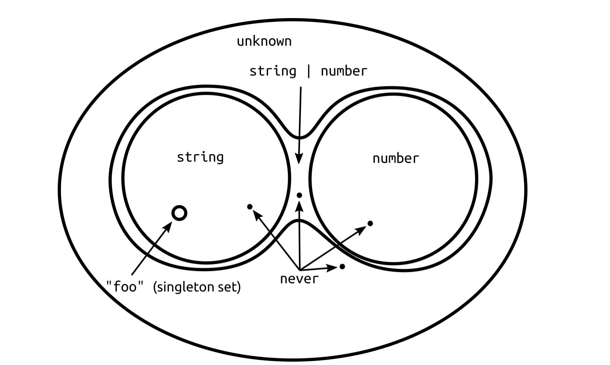
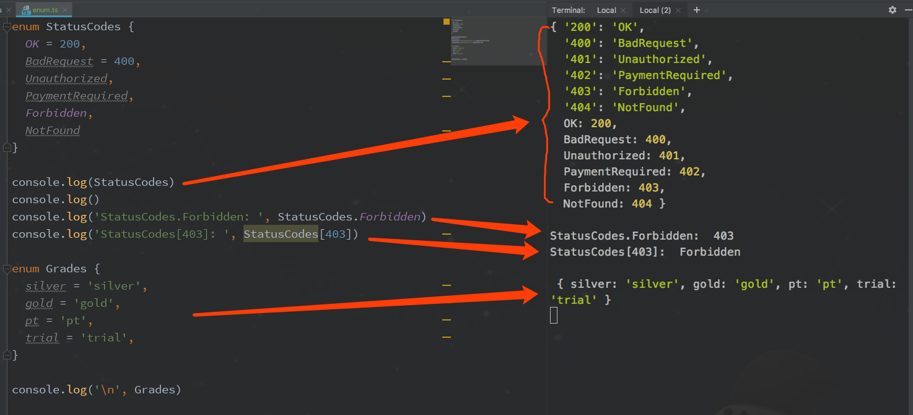
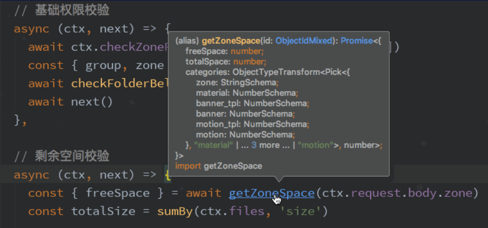

## TypeScript 从入门到精通

<div id="导航" />

# 导航

- [介绍](#介绍)
- [使用入门](#使用入门)
- [基本类型和语法](#基本类型和语法)
  - 原始类型
  - 数组
  - 接口
  - 枚举
  - 泛型
  - 类型守护
  - 重载函数
  - type 类型别名
  - 联合类型 |
  - 交叉类型 &
- [高级类型和语法](#高级类型和语法)
  - 特殊类型
    - any
    - never / unknown
    - void
  - namespace 命名空间
  - in 可以遍历枚举类型
  - infer
  - typeof 捕获变量的类型
  - typeof 捕获类成员的类型
  - keyof 捕获键的名称
  - as const
  - readonly
  - 内置类型别名
  - 自定义类型
    - 模块内类型
    - 全局类型
    - 全局工具方法
- [TS 3.7 最新语法](#ts-37-最新语法)
  - Optional Chaining（可选链操作符）
  - Nullish Coalescing（双问号操作符）
- [让 TypeScript 变得更好](#让-typescript-变得更好)
  - 不解人意的对象类型
  - SuperEnum vs Enum
  - 类型提示最终处理结果
- [参考文章](#参考文章)

<div id="介绍" />

# 介绍

1. TypeScript 具有类型系统，是 JavaScript 的超集
2. 业界有很多项目用 TypeScript 开发，包括：

   - Web 框架：angular / mobx
   - UI：ant-design / Grafana
   - 游戏框架：Babylon.js / egret
   - 服务器框架：nest.js / deno / typeorm
   - App 框架：ionic / NativeScript
   - IDE: VSCode

3. IDE 对 TypeScript 支持很友好，包括智能提示和依赖自动导入
4. 支持类型校验、枚举、泛型、注解、接口
5. 只负责编译，无运行时，不引入额外开销
6. 始终与 ESMAScript 语言标准一致

<p align="right"><b><a href="#导航">↥ 返回顶部</a></b></p>

<div id="使用入门" />

# 使用入门

## Hello World

1. 安装依赖

   ```bash
   yarn add typescript ts-node
   ```

2. 创建必要文件

   - index.ts
   - tsconfig.json

3. 测试运行

   ```bash
   npx ts-node index.ts
   ```

4. 编译成 JavaScript

   ```bash
   tsc index.ts
   ```

<p align="right"><b><a href="#导航">↥ 返回顶部</a></b></p>

<div id="基本类型和语法" />

# 基本类型和语法

## 原始类型

```ts
const num: number = 123
function identity(num: number): number {
  return num
}
```

## 数组

```ts
let boolArray: boolean[]
```

## 接口

```ts
interface Name {
  first: string
  second: string
}

let name: Name
name = {
  first: "John",
  second: "Doe"
}
```

接口变量可以通过重复声明来扩展

```ts
interface Point {
  x: number
  y: number
}

interface Point {
  z: number
}

let myPoint: Point = {
  x: 1,
  y: 2,
  z: 3
}

console.log(myPoint.z)
```

## 枚举

枚举是组织相关联的常量的一种方式，许多编程语言都有枚举数据类型

```ts
enum Colors {
  Red,
  Blue,
  Green
}
```

默认情况下，第一个枚举值是 `0`，后续值自增一

## 泛型

```ts
function reverse<T>(items: T[]): T[] {
  const ret = []
  for (let i = items.length - 1; i >= 0; i--) {
    ret.push(items[i])
  }
  return ret
}

const sample = [1, 2, 3]
let reversed = reverse(sample)

reversed[0] = "1" // Error
reversed = ["1", "2"] // Error

reversed[0] = 1 // ok
reversed = [1, 2] // ok
```

## 类型守护

类型守护是一种错误提示机制。
JavaScript 一个常用的方式就是使用 typeof 或者 instanceof 来在运行时检查一个表达式的类型。TypeScript 现在可在 if 区域块中理解这种情况。

```ts
let xyz = {}
if (typeof xyz === "string") {
  console.log(xyz.slice(3, 1)) // ok
  console.log(xyz.splice(3, 1)) // Error
}
```

## 重载函数

在 JavaScript 中，依据不同参数类型或参数个数执行一些不同函数体的实现很常见。TypeScript 提供了重载函数的功能，可以精确定义函数接收的参数类型。

```ts
interface User {
  name: string
  age: number
}

declare function addAge(para: User | userId, flag?: boolean): number
```

## type 类型别名

TypeScript 提供使用类型注解的便捷语法，你可以使用 `type Var = SomeType` 的语法来创建别名：

```ts
type StrOrNum = string | number

let data: StrOrNum
data = 123
data = "123"

// 会检查类型
sample = true // Error
```

与接口不同，你可以为任意的类型注解提供类型别名（在联合类型和交叉类型中比较实用），下面是一些能让你熟悉语法的示例。

```ts
type Text = string | { text: string }
type Coordinates = [number, number]
type Callback = (data: string) => void
```

## 联合类型 |

联合类型与下面的交叉类型利用了位运算逻辑操作符 `|` 和 `&`，先回顾下位运算逻辑：

```ts
1001 | 1010 = 1011    // 合并1
1001 & 1010 = 1000    // 只保留共有1
```

在 TypeScript 中的表现：

```ts
interface IA {
  a: string
  b: number
}

type TB = {
  b: number
  c: number[]
}

type TC = IA | TB // TC类型的变量的键只需包含ab或bc即可，当然也可以abc都有
type TD = IA & TB // TD类型的变量的键必需包含abc
```

实际用法：

```ts
function formatCommandline(command: string[] | string) {
  let line = ""
  if (typeof command === "string") {
    line = command.trim()
  } else {
    line = command.join(" ").trim()
  }
  return line
}

var myType: string[] | string | number | boolean
// myType类型可以是字符串数组、字符串、数字、布尔值
myType = "type"
myType = ["a", "b", "c"]
myType = 100
myType = false

// 不可以是其他类型
myType = function() {} //报错
```

## 交叉类型 &

在 JavaScript 中， extend 是一种非常常见的模式，在这种模式中，你可以从两个对象中创建一个新对象，新对象会拥有着两个对象所有的功能。交叉类型可以让你安全的使用此种模式：

```ts
function extend<T, U>(first: T, second: U): T & U {
  const result = <T & U>{}
  for (let id in first) {
    ;(<T>result)[id] = first[id]
  }
  for (let id in second) {
    if (!result.hasOwnProperty(id)) {
      ;(<U>result)[id] = second[id]
    }
  }

  return result
}

const x = extend({ a: "hello" }, { b: 42 })

// 现在 x 拥有了 a 属性与 b 属性
const a = x.a
const b = x.b
```

<p align="right"><b><a href="#导航">↥ 返回顶部</a></b></p>

<div id="高级类型和语法" />

# 高级类型和语法

## 特殊类型

### any

`any` 类型在 TypeScript 类型系统中占有特殊的地位。它提供给你一个类型系统的「后门」，可以把类型检查关闭。在类型系统里 `any` 能够兼容所有的类型（包括它自己）。因此，所有类型都能被赋值给它，它也能被赋值给其他任何类型。

### never / unknown

`never` 和 `unknown` 分别是 TypeScript 2.0 和 3.0 引入的新概念。
`never` 表示不会出现的类型，是最小子集，一般用在出现错误的场景；与 `void` 的差异在于，`void` 表示空类型，`never` 表示永远不会返回的类型。`void` 变量可以被赋空值，`never` 变量不能被赋值。
`unknown` 表示任意类型；与 `any` 不同的地方在于，`any` 是关闭了类型检查，并不代表一种类型集合。



`never` 示例：

> 实际上的体现就是只能抛出错误

```ts
function fail(message: string): never {
  throw new Error(message)
}

let foo: never = 123 // 赋值会报错
```

`Any`
```typescript
let value: any

value = 'xxx'   // OK
value.foo.bar()  // OK

let value2: string = value  // OK
```

`unknown`
```typescript
let value: unknown

value = 'xxx'   // OK
value.foo.bar()  // Error

let value2: string = value  // Error
```

### void

```ts
function log(message: string): void {
  console.log(message)
}
```

## namespace 命名空间

```ts
namespace Utility {
  export function log(msg) {
    console.log(msg)
  }
  export function error(msg) {
    console.log(msg)
  }
}

// usage
Utility.log("Call me")
Utility.error("maybe")
```

`namespace` 关键字通过 TypeScript 编译后，与我们看到的 JavaScript 代码一样：

```js
;(function(Utility) {
  // 添加属性至 Utility
})((Utility || Utility = {}))
```

## in 可以遍历枚举类型

```ts
type Keys = "a" | "b"
type Obj = { [p in Keys]: any } // -> { a: any, b: any }
```

## infer

`infer` 表示在 `extends` 条件语句中待推断的类型变量。

```ts
type ReturnType<T> = T extends (...args: any[]) => infer R ? R : any
```

其实这里的 `infer R` 就是声明一个变量来承载传入函数签名的返回值类型, 简单说就是用它取到函数返回值的类型方便之后使用。

## typeof 捕获变量的类型

你可以通过 `typeof` 关键字告诉编译器，某变量的类型与其他类型相同，如下所示：

```ts
let foo = 123
let bar: typeof foo // 'bar' 类型与 'foo' 类型相同（在这里是： 'number'）

bar = 456 // ok
bar = "789" // Error: 'string' 不能分配给 'number' 类型
```

## typeof 捕获类成员的类型

与捕获变量的类型相似，你仅仅是需要声明一个变量用来捕获到的类型：

```ts
class Foo {
  foo: number // 我们想要捕获的类型
}

declare let _foo: Foo

// 与之前做法相同
let bar: typeof _foo.foo
```

## keyof 捕获键的名称

`keyof` 操作符能让你捕获一个类型的键。例如，你可以使用它来捕获变量的键名称，在通过使用 `typeof` 来获取类型之后：

```ts
const colors = {
  red: "red",
  blue: "blue"
}

type Colors = keyof typeof colors

let color: Colors // color 的类型是 'red' | 'blue'
color = "red" // ok
color = "blue" // ok
color = "anythingElse" // Error
```

## as const

@TODO:

## readonly

@TODO:

## 内置类型别名

https://www.typescriptlang.org/docs/handbook/utility-types.html

Partial / Required / Readonly / Pick / Record / Exclude / Extract / ReturnType / ThisType / InstanceType / NonNullable / Parameters / ConstructorParameters

@TODO:

<p align="right"><b><a href="#导航">↥ 返回顶部</a></b></p>

<div id="参考文章" />

# TS 3.7 最新语法

## Optional Chaining（可选链操作符）

```typescript
// before
if (user && user.address) {
  // ...
}

callback && callback()

// after
if (user?.address) {    // 自判断属性访问
  // ...     
}

callback?.()    // 自判断函数调用
```
## Nullish Coalescing（双问号操作符）

```typescript
// before
const isBlack = params.isBlack || true   // ❌
const isBlack = params.hasOwnProperty('isBlack') ? params.isBlack : true  // ✅

// after
const isBlack = params.isBlack ?? true  // ✅
```

<p align="right"><b><a href="#导航">↥ 返回顶部</a></b></p>

# 让 TypeScript 变得更好

### 在编译完成的代码中没有进行路径解析
> Module path maps are not resolved in emitted code #10866
> https://github.com/microsoft/TypeScript/issues/10866

解决方案：

```typescript
// tsc 编译后支持
tscpaths: tsc && tscpaths -p tsconfig.json -s ./src -o ./dist

// ts-node 运行支持
tsconfig-paths: npx ts-node -r tsconfig-paths/register src/index.ts
```

## 不解人意的对象类型

`src/better/object-type`

## SuperEnum vs Enum

`Enum`:



`superEnum` 数字类型（变得更强）：

```typescript
superEnum Grades {
  silver = 2,
  gold,
  pt,
  trial,
}

// 第一种变体
console.log(Grades.values)        // [2, 3, 4, 5]
console.log(Grades.keys)          // ['silver', 'gold', 'pt', 'trial']
console.log(Grades.map.silver)    // 2
console.log(Grades.map[2])        // 'silver'
console.log(Grades.map)           // { silver: 2, gold: 3, pt: 4, trial: 5, '2': silver, ... '5': 'trial' }

// 第二种变体，增加关键字 values、keys、map
console.log(Grades.values)        // [2, 3, 4, 5]
console.log(Grades.keys)          // ['silver', 'gold', 'pt', 'trial']
console.log(Grades.silver)        // 2
console.log(Grades[2])            // 'silver'
console.log(Grades.map)           // { silver: 2, gold: 3, pt: 4, trial: 5, '2': silver, ... '5': 'trial' }
```

`superEnum` 字符串类型（变得更智能）：

```typescript
superEnum Grades {
  silver: string,
  gold,
  pt,
  trial,
}

console.log(Grades.values)        // ['silver', 'gold', 'pt', 'trial']
console.log(Grades.keys)          // ['silver', 'gold', 'pt', 'trial']
console.log(Grades.map.silver)    // 'silver'
console.log(Grades.map)           // { silver: 'silver', gold: 'gold', pt: 'pt', trial: 'trial' }
```

`superEnum` 类型混合：

```typescript
superEnum Grades: string {
  silver = 2,
  gold: string,
  pt = 'platinum',
  trial,
}

console.log(Grades.values)        // [2, 'gold', 'platinum', 'trial']
console.log(Grades.keys)          // ['silver', 'gold', 'pt', 'trial']
console.log(Grades.map.silver)    // 2
console.log(Grades.map[2])        // 'silver'
```

## 类型提示最终处理结果



Real Reference: `utils/zone-space`

<p align="right"><b><a href="#导航">↥ 返回顶部</a></b></p>

# 参考文章

- [深入理解 TypeScript](https://jkchao.github.io/typescript-book-chinese/)（英文版：[TypeScript Deep Dive](https://basarat.gitbooks.io/typescript/)）
- [TypeScript 强大的类型别名](https://juejin.im/post/5c2f87ce5188252593122c98)
